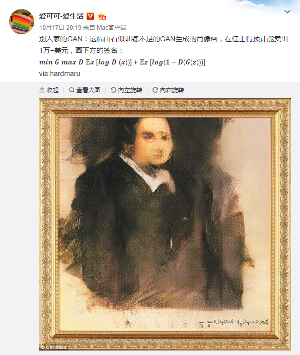

# 2018-10-26

https://weibo.com/1402400261/GEmL0cQoc

- 𝒎𝒊𝒏 𝑮 𝒎𝒂𝒙 𝑫 𝔼𝒙 [𝒍𝒐𝒈 𝑫 (𝒙))] + 𝔼𝒛 [𝒍𝒐𝒈(𝟏 − 𝑫(𝑮(𝒛)))]
  - GANs: 最小的生成误差, 最大的判别误差
- [awesome GANs!!!:smile:](https://poloclub.github.io/ganlab/)

# 2018-10-18

## [博士五年之后五年的总结（其一）](https://zhuanlan.zhihu.com/p/45703402)

$技术, 感悟

经验的积累, 方法的总结至关重要. 作为毕业五年的优秀毕业生, 他都有些什么感悟呢?

> 读什么东西，就成为什么样的人。
>
> 在日积月累之下，做或者不做这些，会让每个人最终成为不一样的人。
>
> 所以多看点动脑的内容，就不会让大脑生锈。做科研一个比较好的地方是工作本身并不重复，而是一直在开拓边界，这样自然会有更多的动脑时间。在闲暇时间，我经常会多看知乎上做数学和物理的同学们的回答，最好有几个不懂的名词需要自己去查去想想，手机上有个刷Arxiv的app经常看看，看一看一些优秀的github代码，也会动手刷刷题。

作者从多个角度总结了自己的经验

- 选方向？先要控制自己阅读的入口
- 如何选方向
- 如何抓紧时间
- 如何坚持一个长期的方向

作者的文笔是相当不存的, 简单而充实. 

另外, 还有其他的后续的几篇, 值得阅读

- [远东轶事](https://zhuanlan.zhihu.com/yuandong)

