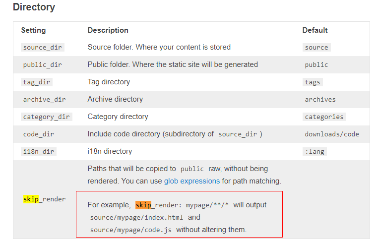

经过好多天的努力，博客基本上也达到了自己满意的样子。博客以[Bootstrap-Blog](http://cgmartin.github.io/hexo-theme-bootstrap-blog/)为蓝本，在此基础上增增减减，修修改改。因为自己并不是很懂网页，大多时候都是摸索和调试，所以费时还是挺多的。现在终于能踏踏实实的写文章了。

之前我也用过很多博客，但是自己却很少认认真真的写过文章。原因之一就是自己文笔不好，思考半天都写不出来一句话。从小学到大学，作文一直就是我的痛点，时间费得最多，效果还不是很好，这也是我可提高之处吧！现在，我想我得尽量多写吧，至少搭建这个博客我还是挺费心的。其实很多时候不必思考过多，随心所欲，应该也是很不错的。

写这篇文章的目的是对我的Hexo之旅做一个小结，也算对这次博客搭建告一段落。

## 所参考的一些链接

当然，最主要的还是[Hexo官网](https://hexo.io/zh-cn/)上的资源，包括教程、主题等等。

### 详细教程

[如何搭建一个独立博客——简明Github Pages与Hexo教程](http://www.jianshu.com/p/05289a4bc8b2/)
这篇文章十分详细，作者在后面给了很多其他教程的链接。
[图灵社区：Hexo合集](http://www.ituring.com.cn/minibook/29442)
这篇文章对于Hexo的使用更加详细，适合想要深度折腾的同学。

### 增增减减

[Hexo，添加返回顶部按钮](http://yehbeats.com/2015/04/06/hexo-topmenu/)，如果打不开，请点击[这里](http://blog.disonchen.com/2015/08/31/Hexo%EF%BC%8C%E6%B7%BB%E5%8A%A0%E8%BF%94%E5%9B%9E%E9%A1%B6%E9%83%A8%E6%8C%89%E9%92%AE/)

### 一些问题

[npm国内被墙的解决方法](http://snoopyxdy.blog.163.com/blog/static/60117440201422695653698/)，应该前两步就能解决。
连接挂掉, 补(http://blog.csdn.net/qq_23329541/article/details/68927747)
```
npm config set strict-ssl false
npm config set registry "http://registry.npmjs.org/"
```
[被墙的另一个解决方法](http://www.jianshu.com/p/0deb70e6f395)。
[使用taobao npm镜像](http://npm.taobao.org/)
`npm install -g cnpm --registry=https://registry.npm.taobao.org`
[搭建 hexo，在执行 hexo deploy 后,出现 error deployer not found:github 的错误](http://www.v2ex.com/t/175940)

**OK, 剩下的就是好好的写文章吧！**

---
# 160622更新

设置sublime_text为默认编辑器

```
git config --global core.editor "'D:/Program Files (x86)/Sublime Text/sublime_text.exe' -w"
```

设置Notepad++为默认编辑器

```
git config --global core.editor "'D:/Program Files (x86)/Notepad++/notepad++.exe' -multiInst -nosession"
```

直接使用命令`subl`编辑文本

把sublime_text.exe的所在目录添加至环境变量的path中
在Git下直接使用命令

```
subl filename.txt
```

就可以直接使用sublime text编辑文本文件了

参考链接: https://git-scm.com/book/en/v2/Getting-Started-First-Time-Git-Setup

---
# 161104更新

使用上述教程部署网站出现错误
```
$ hexo d
	...
nothing to commit, working tree clean
bash: /dev/tty: No such device or address
error: failed to execute prompt script (exit code 1)
fatal: could not read Username for 'https://github.com': Invalid argument
FATAL Something's wrong. Maybe you can find the solution here: http://hexo.io/docs/troubleshooting.html
Error: bash: /dev/tty: No such device or address
error: failed to execute prompt script (exit code 1)
fatal: could not read Username for 'https://github.com': Invalid argument
	...
```

解决方法：
```
修改根目录文件：_config.yml
原有内容：
	repository: https://github.com/username/username.github.io.git
修改为：
	repository: git@github.com:username/username.github.io.git
```

参考链接：http://www.jianshu.com/p/d1fc64c445ce

---
# update for detail steps

```
download git
download node.js

// gen ssh-key 
ssh-keygen -t rsa -C "username@gmail.com"

// add ssh-key to github
(http://blog.csdn.net/keyboardota/article/details/7603630)

// verify
ssh -T git@github.com

// config
git config --global user.name "username"
git config --global user.email "username@gmail.com"

npm install -g cnpm --registry=https://registry.npm.taobao.org

cnpm install -g hexo
cnpm install hexo-deployer-git --save

// or use taobao mirror
// npm config set strict-ssl false
// npm config set registry "http://registry.npmjs.org/"
// npm install -g hexo
// npm install hexo-deployer-git --save

cd your_hexo_dir
hexo init
```

# 2017-9-6 update
add quick generate_deploy.bat

``` bat
@echo off & rem not print commond
title Hexo & rem setting title
rem cd D:/github/hexo
"D:\Program Files\Git\bin\sh.exe" --login -i -c "cd /d/github/hexo && hexo generate --deploy"
pause
exit
```

ref:
https://stackoverflow.com/questions/5203723/how-do-i-write-a-batch-file-which-opens-the-gitbash-shell-and-runs-a-command-in
https://segmentfault.com/q/1010000000263597
https://www.zhihu.com/question/38962022
http://t.cn/RA4BPda


# update

## 代码块空行问题

change hexo util file highlight.js
file path: your_hexo_dir/node_modules/hexo-util/lib/highlight.js

update code 
``` js
  for (var i = 0, len = lines.length; i < len; i++) {
    line = lines[i];
    if (tab) line = replaceTabs(line, tab);
    numbers += '<span class="line">' + (firstLine + i) + '</span>';
    content += '<span class="line';
    content += (mark.indexOf(firstLine + i) !== -1) ? ' marked' : '';
    content += '">' + line + '</span>';
  }
```
to code
``` js
  for (var i = 0, len = lines.length; i < len; i++) {
    line = lines[i];
    if (tab) line = replaceTabs(line, tab);
    // numbers += '<span class="line">' + (firstLine + i) + '</span>';
    // content += '<span class="line';
    // content += (mark.indexOf(firstLine + i) !== -1) ? ' marked' : '';
    // content += '">' + line + '</span>';
    
    numbers += '<span class="line">' + (i + firstLine) + '</span>\n';
    content += '<span class="line">' + line + '</span>\n';
  }
```

ref:
http://blog.csdn.net/tobacco5648/article/details/42584653
http://xingwu.me/2014/11/08/Hexo-Code-Block-Bugs-Comments-Style-and-Empty-Lines/


# permalink config
https://clearsky.me/hexo-permalinks.html
http://www.wuliaole.com/post/permalink_and_internal_link_in_hexo/

# 2018-10-13 update

## 添加公式

`hexo-math`已经被抛弃了, 所以使用`hexo-math`并无任何效果, 使用`hexo-renderer-mathjax`进行替代

如果你已经安装了`hexo-math`, 需要先卸载

```$ npm uninstall hexo-math --save```

然后, 安装`hexo-renderer-mathjax`

```$ npm install hexo-renderer-mathjax --save```

在主题的配置文件`_config.yml`中添加下面属性, 配置`mathjax`

```
# MathJax Support
mathjax:
  enable: true
  per_page: true
  cdn: //cdn.bootcss.com/mathjax/2.7.1/latest.js?config=TeX-AMS-MML_HTMLorMML
```

OK, 下面是一些测试

```
行內公式 $\sin ^{ 2 }{ \theta +\cos ^{ 2 }{ \theta =1 }  }$ 行內公式

行外公式

$$\frac { dy }{ dx } =\frac { { e }^{ x } }{ 3{ y }^{ 2 } }$$
```


行內公式 $\sin ^{ 2 }{ \theta +\cos ^{ 2 }{ \theta =1 }  }$ 行內公式

行外公式
$$\frac { dy }{ dx } =\frac { { e }^{ x } }{ 3{ y }^{ 2 } }$$


参考链接: https://nathaniel.blog/tutorials/make-hexo-support-math-again/

另外, 推荐一个主题[next](https://github.com/iissnan/hexo-theme-next)

### mathjax Mixed Content导致不能渲染公式

### 或者(chrome出现一个拦截图标, 不安全连接)


#### 前面的两个错误`Uncaught Reference Error`

加载js的顺序不对, 需要先加载jquery, 然后再加载后两个js

#### 第三个问题, 也就是渲染公式

修改`[hexo_root]\node_modules\hexo-renderer-mathjax\mathjax.html:`

把最后一行

```html
<script type="text/x-mathjax-config">
    MathJax.Hub.Config({
        tex2jax: {
            inlineMath: [ ["$","$"], ["\\(","\\)"] ],
            skipTags: ['script', 'noscript', 'style', 'textarea', 'pre', 'code'],
            processEscapes: true
        }
    });
    MathJax.Hub.Queue(function() {
        var all = MathJax.Hub.getAllJax();
        for (var i = 0; i < all.length; ++i)
            all[i].SourceElement().parentNode.className += ' has-jax';
    });
</script>
<script src="http://cdn.mathjax.org/mathjax/latest/MathJax.js?config=TeX-AMS-MML_HTMLorMML"></script>
```

替换为

```html
<script src="https://cdnjs.cloudflare.com/ajax/libs/mathjax/2.7.5/MathJax.js?config=TeX-MML-AM_CHTML"></script>
```

即修改了渲染js的地址, 地址来源于官网: https://docs.mathjax.org/en/latest/start.html

参考: https://github.com/hexojs/hexo/issues/3279 

! 尝试了修改hexo下的配置和主题下的配置添加下面内容都无效

```
mathjax:
  cdn: //cdnjs.cloudflare.com/ajax/libs/mathjax/2.7.5/MathJax.js?config=TeX-MML-AM_CHTML
```


## 添加新页面

https://github.com/hexojs/hexo/issues/1453

## hexo template

- https://hexo.io/docs/templates.html
- https://hexo.io/zh-cn/docs/helpers.html

## 添加目录

`article.ejs`中添加

```
  <!-- TOC -->
  <% var mtoc = toc(post.content, {list_number: false}); %>
  <% if (mtoc) { %>            
    <div class="toc">
      <h3>Content</h3>
      <%- mtoc %>  
    </div>
  <% } %>
```

`custom.css`中添加

```
.toc {
  background-color: #eee;
  padding-left: 25px;
}
```

参考:

- http://izhaoyi.top/2017/05/30/my-blog/#%E6%96%87%E7%AB%A0%E7%9B%AE%E5%BD%95

### windows图床工具

- https://jverson.com/2017/05/28/qiniu-image-v2/

七牛云不支持测试域名了, 需要自己的域名, 后面就没测试了

---

awesome themes:

- https://github.com/geekplux/hexo-theme-typing


### 添加 readme

- https://stackoverflow.com/questions/25258660/how-do-i-add-a-readme-md-file-into-the-root-directory-of-the-generated-blog-by-h/31051913#31051913

注意, 上面很多方法都是不可行的

包含

- https://stackoverflow.com/questions/25258660/how-do-i-add-a-readme-md-file-into-the-root-directory-of-the-generated-blog-by-h
- https://github.com/hexojs/hexo/issues/3158
- https://github.com/hexojs/hexo/issues/3248
- http://xchb.work/2017/04/08/hexo%E5%BF%BD%E7%95%A5%E6%96%87%E4%BB%B6-skip-render-%E9%85%8D%E7%BD%AE/
- https://xuanwo.org/2014/08/14/hexo-usual-problem/

正确的解决方法

- https://hexo.io/docs/configuration#Directory



即README.md文件必须要在source目录下!!!


## 永久链接

https://clearsky.me/hexo-permalinks.html

