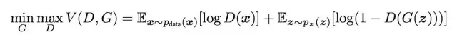

# [深入浅出：GAN原理与应用入门介绍](https://mp.weixin.qq.com/s/YnOF9CCUFvtaiTY8HXYOuw)

是一类在无监督学习中使用的神经网络

致力于通过学习恒等函数 f（x）= x 从数据中提取特征，且都依赖马尔可夫链来训练或生成样本。

- 相似的无监督学习方法还包含
  - 玻尔兹曼机（Geoffrey Hinton 和 Terry Sejnowski，1985）
  - 自动解码器（Dana H. Ballard，1987）

## 什么是GAN

想要学习生成器的分布，应该定义数据 $x$ 的参数 $p_g$，以及输入噪声变量 $p_z（z）$的分布。然后 $G（z，θ_g）$将 $z$ 从潜在空间 $Z$ 映射到数据空间，$D（x，θ_d）$输出单个标量——一个 $x$ 来自真实数据而不是 $p_g$ 的概率。

训练判别器以最大化正确标注实际数据和生成样本的概率。训练生成器用于最小化 $log（1-D（G（z）））$。换句话说，尽量减少判别器得出正确答案的概率。

可以将这样的训练任务看作具有值函数 $V（G，D）$的极大极小博弈：

换句话说，生成器努力生成判别器难以辨认的图像，判别器也愈加聪明，以免被生成器欺骗。

> 「对抗训练是继切片面包之后最酷的事情。」- Yann LeCun

当判别器不能区分 $p_g$ 和 $p_data$，即 $D（x，θ_d）= 1/2$ 时，训练过程停止。达成生成器与判别器之间判定误差的平衡。

## 例如

我们应该获得每个标记的特征表示，但是应用常规机器学习和深度学习方法（包括卷积神经网络）存在一些问题：

- 它们需要大量标注图像；
- 商标没有标注；
- 标记无法从数据集分割出去。

这种新方法显示了如何使用 GAN 从商标的图像中**提取和学习特征**。在学习每个标记的表征之后，就可以在扫描文档上按图形搜索。

## 生成模型具有模拟真实数据样本的性能

