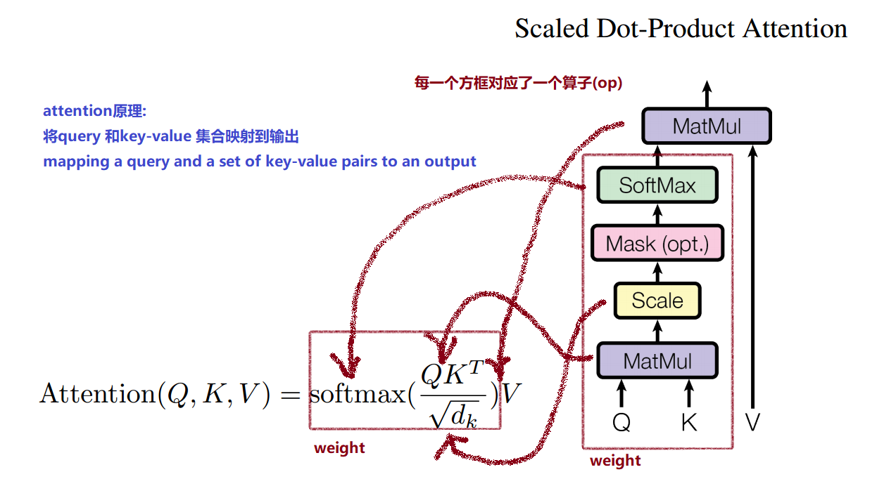
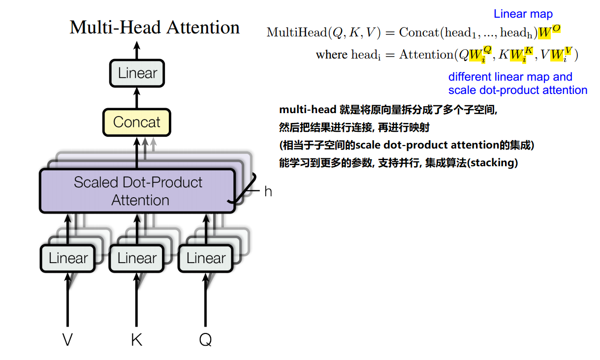

传说BERT牛皮得不行, 好奇看了看.

里面用到了Transformer Block, 这是什么结构? 其实也就是Attention as all you need的Transformer.

之前读Attention as all you need 也是云里雾里的, 今天又再看了看这个Transformer的结构.

首先说说attention 的原理:

- 将query 和key-value 对的集合 映射到输出
- (将query 和key 计算出一个关于value 的weight (也就是attention), 然后输出)

Transformer也就是attention的具体实现, 总的有两种结构:

- Scaled Dot-Product Attention
- Multi-Head Attention

### Scaled Dot-Product Attention

- 右边的结构图中, 每个方框对应一个算子, 可以和公式中的每个计算对应
- weight 就是attention. 就是对于value有不同的权重(attention)

### Multi-Head Attention

multi-head 就是将原始的向量拆分为多个子向量(或者做不同的映射成多个向量)

然后每个子向量分别做scale dot-product attetion

然后把计算的结果进行连接, 再做一次映射作为输出

// multi-head 相当于拆分后子空间的scale dot-product attention的集成(stacking), 

// 能学习到更多的参数, 支持并行