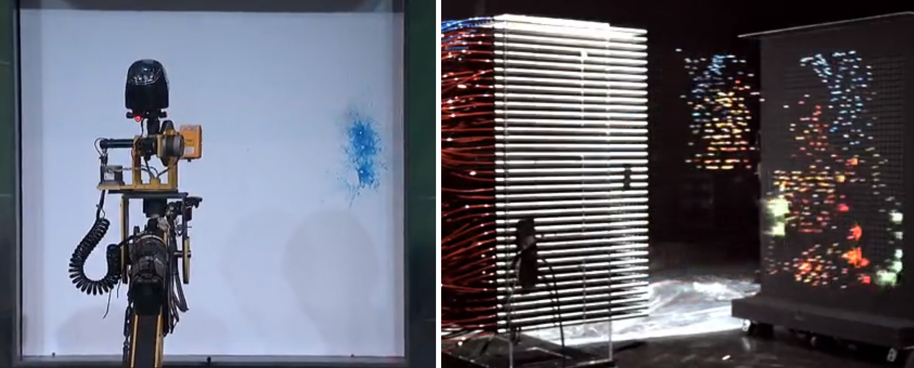

# Nvidia

https://www.nvidia.cn/object/what-is-gpu-computing-cn.html

## GPU 与 CPU 性能比较

> 理解 GPU 和 CPU 之间区别的一种简单方式是比较它们**如何处理任务**。CPU 由专为**顺序串行处理**而优化的几个核心组成，而 GPU 则拥有一个由数以千计的更小、更高效的核心（专为**同时处理多重任务**而设计）组成的**大规模并行计算架构**。

### CPU串行处理 VS GPU并行处理

总的来说在于核心数上面的优势, CPU一般核心数是较少了(Intel Core i9-7980XE @ 2.60GHz, 18core), 而GPU核心数较多(NVIDIA TESLA V100/CUDA 5120)

参考:

- http://itianti.sinaapp.com/index.php/cpu
- http://itianti.sinaapp.com/index.php/gpu
- https://ark.intel.com/compare/126699,120496
- https://www.nvidia.com/zh-cn/deep-learning-ai/
- https://item.jd.com/31346484884.html [京东NVIDIA TESLA V100介绍]

### cuda

### CUDA

CUDA 是 NVIDIA 发明的一种并行计算平台和编程模型。它通过利用图形处理器 (GPU) 的处理能力，可大幅提升计算性能。

https://www.geforce.cn/hardware/technology/cuda

#### tensor core

https://www.nvidia.com/en-us/data-center/tensorcore/