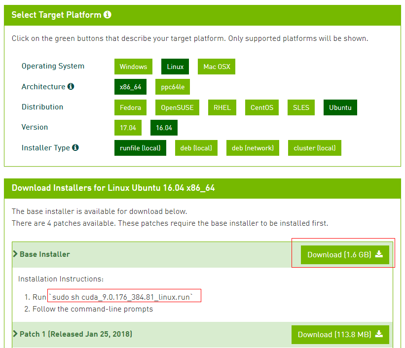
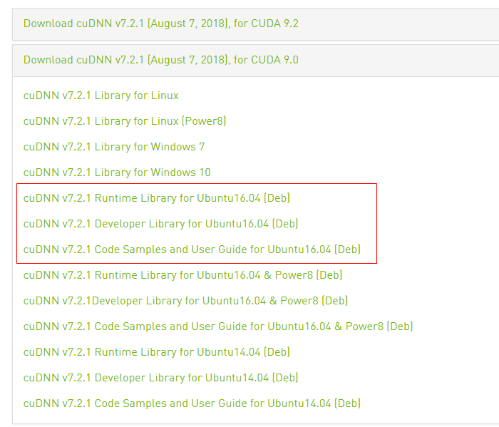

## 安装TensorFlow

### anaconda

下载: [python3.6版本](https://mirrors.tuna.tsinghua.edu.cn/anaconda/archive/Anaconda3-5.2.0-Linux-x86_64.sh)

安装: `sudo sh Anaconda3-5.2.0-Linux-x86_64.sh `

### tensorflow

从pypi下载已经编译好的`tensorflow_gpu`

- https://pypi.org/project/tensorflow-gpu/#files

tensorflow_gpu依赖的python package, 一部分可以在[python uci package](https://www.lfd.uci.edu/~gohlke/pythonlibs/)下载, 一部分仍在在[pypi](https://pypi.org/)下载.

```
tensorflow_gpu-1.10.1-cp36-cp36m-manylinux1_x86_64.whl
absl_py-0.4.0-py2.py3-none-any.whl
astor-0.7.1-py2.py3-none-any.whl
gast-0.2.0-py2.py3-none-any.whl
grpcio-1.14.1-cp36-cp36m-manylinux1_x86_64.whl
msgpack-0.5.6-cp36-cp36m-manylinux1_x86_64.whl
numpy-1.14.5-cp36-cp36m-manylinux1_x86_64.whl(版本限制!)
protobuf-3.6.1-cp36-cp36m-manylinux1_x86_64.whl
termcolor-1.1.0-py2.py3-none-any.whl
tensorboard-1.10.0-py3-none-any.whl
Markdown-2.6.11-py2.py3-none-any.whl
```

安装: `pip install XXX.whl`

## 安装Cuda

- 下载: [cuda9.0](https://developer.nvidia.com/cuda-90-download-archive?target_os=Linux&target_arch=x86_64&target_distro=Ubuntu&target_version=1604&target_type=deblocal)
- 
- 安装: `sudo sh cuda_9.0.176_384.81_linux.run`
  - 当提示安装`openGL`, 若为双显卡且主显为非NVIDIA GPU, 则选择`no`
  - 安装cuda出现的问题. 因为cuda需要修改显卡驱动, 因此需要关闭图形界面.

```
# error:
It appears that an X server is running. 
Please exit X before installation. 
If you're sure that X is not running, 
but are getting this error, 
please delete any X lock files in /tmp.

# solution:
/etc/init.d/lightdm stop
# 然后重启
reboot
# refs: https://www.cnblogs.com/liyuanhong/articles/4919755.html
# 重启图形界面
sudo service lightdm start
或sudo lightdm restart
```

- 验证
  - 输入`ls /dev/nvidia*`
    - 若显示`/dev/nvidia0      /dev/nvidiactl      /dev/nvidia-uvm`, 则安装成功.
    - 若显示`ls: cannot access/dev/nvidia*: No such file or directory`, 或`/dev/nvidia0     /dev/nvidiactl`(安装成功中显示中的一个或两个), 则需修改启动文件
      - `sudo vi /etc/rc.local`
      - 把第一行的`#!/bin/sh -e`中的`-e`去掉
      - 然后在`exit 0`前面插入下面运行脚本
      - 输入脚本后, 运行`source /etc/rc.local`更新
      - 在运行`ls /dev/nvidia*`将会看到三个文件, 则安装成功

```
/sbin/modprobe nvidia

if [ "$?" -eq 0 ]; then
	# Count the number of NVIDIA controllers found.
	NVDEVS=`lspci | grep -i NVIDIA`
	N3D=`echo "$NVDEVS" | grep "3D controller" | wc -l`
	NVGA=`echo "$NVDEVS" | grep "VGA compatible controller" | wc -l`
	N=`expr $N3D + $NVGA - 1`
	for i in `seq 0 $N`; do
		mknod -m 666 /dev/nvidia$i c 195 $i
	done
	mknod -m 666 /dev/nvidiactl c 195 255
else
	exit 1
fi

/sbin/modprobe nvidia-uvm

if [ "$?" -eq 0 ]; then
	# Find out the major device number used by the nvidia-uvm driver
	D=`grep nvidia-uvm /proc/devices | awk '{print $1}'`
	mknod -m 666 /dev/nvidia-uvm c $D 0
else
	exit 1
fi
```

​					

- 配置环境变量

  - 运行`sudo gedit /etc/profile` , 在末尾添加下面文本, 然后运行`source /etc/profile`更新

    ​		

```
export CUDA_HOME=/usr/local/cuda-9.0
export PATH=${PATH}:${CUDA_HOME}/bin
export LD_LIBRARY_PATH=${LD_LIBRARY_PATH}:${CUDA_HOME}/lib64
```

- 安装完成后, 运行`nvidia-smi`进行测试

安装cudnn. 这里需要注册一个NVIDIA账户

- 下载: [cuDNN7.2.1](https://developer.nvidia.com/rdp/cudnn-download)

- 
  - 安装(第一个就可以了): `sudo dpkg -i libcudnn7_7.2.1.38-1+cuda9.0_amd64.deb`

- 安装出现问题

```
# error:
/sbin/ldconfig.real: /usr/lib/nvidia-375/libEGL.so.1 is not a symbolic link

# solution:
https://askubuntu.com/questions/900285/libegl-so-1-is-not-a-symbolic-link
第二个脚本可用
```

安装完成后进行测试

- 运行`python`

```
import tensorflow
print(tensorflow.__version__)
```

- 运行问题

```
2018-08-31 16:11:56.214798: I tensorflow/core/platform/cpu_feature_guard.cc:141] Your CPU supports instructions that this TensorFlow binary was not compiled to use: AVX2 FMA
2018-08-31 16:11:56.217297: E tensorflow/stream_executor/cuda/cuda_driver.cc:397] failed call to cuInit: CUDA_ERROR_NO_DEVICE
2018-08-31 16:11:56.217342: I tensorflow/stream_executor/cuda/cuda_diagnostics.cc:157] no NVIDIA GPU device is present: /dev/nvidia0 does not exist
```

- 运行`nvidia-smi`

```
Failed to initialize NVML: Driver/library version mismatch
```

- 原因分析: 
  - 安装cuda失败, 重新安装cuda, cuda的安装可以见[cuda 安装](https://blog.csdn.net/QLULIBIN/article/details/78714596).
  - 安装的cuda版本不对, 则安装对应的cuda, 或者是cuda版本自动更新, 重启电脑解决.

## 参考

TensorFlow官方安装教程

- https://www.tensorflow.org/install/install_linux?hl=zh-cn

cuda 安装

- https://blog.csdn.net/QLULIBIN/article/details/78714596

cudnn 安装

- http://www.itread01.com/content/1501166415.html
