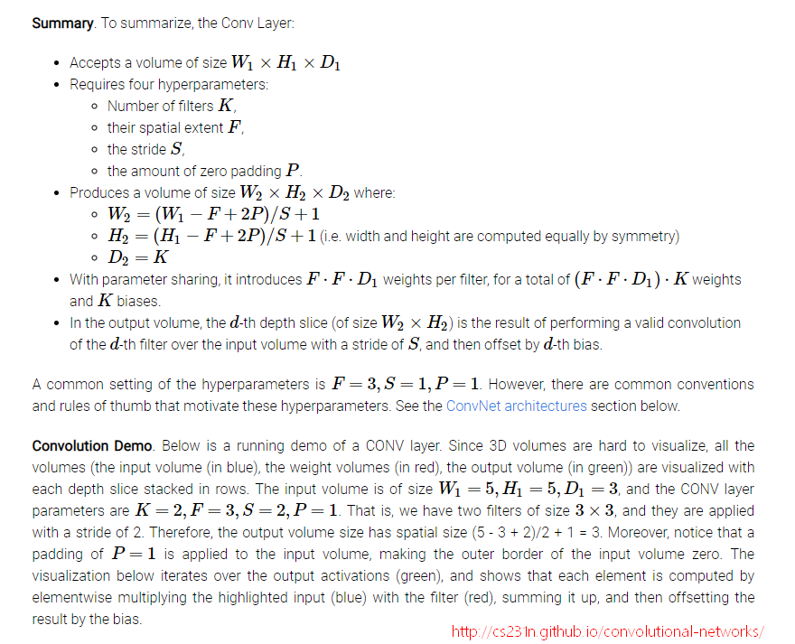
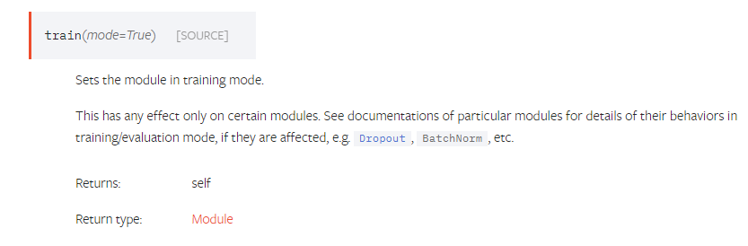

tutorial 地址: [pytorch: Training a Classifier](https://pytorch.org/tutorials/beginner/blitz/cifar10_tutorial.html).

当使用新的数据集进行测试时, 出现的问题及解决的方法.

## Problem 1

error:

``` python
RuntimeError: invalid argument 0: Sizes of tensors must match except in dimension 0. Got 484 and 549 in dimension 2 at /pytorch/aten/src/TH/generic/THTensorMath.cpp:3616
```

location:

``` python
images, labels = data_iter.next()
```

solution:

``` python
数据集中的图像大小不一致.
需要使用`transforms.Resize([height, width])`把所有图像缩放到同一大小.
```

## Problem 2

error:

``` python
RuntimeError: invalid argument 2: size '[-1 x 400]' is invalid for input with 719104 elements at /pytorch/aten/src/TH/THStorage.cpp:80
```

location:

``` python
x = x.view(-1, 16 * 5 * 5)
```

solution:

``` python
`Tensor.view()` 相当于 `numpy.reshape()` 方法, 即重塑形状.
其中`-1`表示依据其他维度进行推理得出的维度.
这里的参数需要计算得出, 不同的输入尺寸需要计算对应的参数!
---
我们来计算一下, 计算公式见下面的图片.
---
input size = 3*32*32
-
class Net_t1(nn.Module):
    def __init__(self):
        super(Net_t1, self).__init__()
        self.conv1 = nn.Conv2d(3, 6, 5)
        self.pool = nn.MaxPool2d(2, 2)
        self.conv2 = nn.Conv2d(6, 16, 5)
        self.fc1 = nn.Linear(16 * 5 * 5, 120)
        self.fc2 = nn.Linear(120, 84)
        self.fc3 = nn.Linear(84, 10)

    def forward(self, x):
        x = F.relu(self.conv1(x))
        x = self.pool(x)
        x = F.relu(self.conv2(x))
        x = self.pool(x)
        x = x.view(-1, 16 * 5 * 5)
        x = F.relu(self.fc1(x))
        x = F.relu(self.fc2(x))
        x = self.fc3(x)
        return x
-
1 torch.Size([4, 6, 28, 28]), conv1, (32 - 5) / 1 + 1 = 28, padding=0
2 torch.Size([4, 6, 14, 14]), pool, 28 / 2 = 14
3 torch.Size([4, 16, 10, 10]), conv2, (14 - 5) / 1 + 1 = 10, padding=0
4 torch.Size([4, 16, 5, 5]), pool, 10 / 2 = 5
5 torch.Size([4, 400]), view, 16 * 5 * 5 = 400
6 torch.Size([4, 120]), full_connect
7 torch.Size([4, 84]), full_connect
8 torch.Size([4, 10]), full_connect
---
input size = 3*224*224
-
class Net_t2(nn.Module):
    def __init__(self):
        super(Net_t2, self).__init__()
        self.conv1 = nn.Conv2d(3, 6, 5)
        self.pool = nn.MaxPool2d(2, 2)
        self.conv2 = nn.Conv2d(6, 16, 5)
        self.fc1 = nn.Linear(16 * 53 * 53, 120)
        self.fc2 = nn.Linear(120, 84)
        self.fc3 = nn.Linear(84, 31)

    def forward(self, x):
        x = F.relu(self.conv1(x))
        x = self.pool(x)
        x = F.relu(self.conv2(x))
        x = self.pool(x)
        x = x.view(-1, 16 * 53 * 53)
        x = F.relu(self.fc1(x))
        x = F.relu(self.fc2(x))
        x = self.fc3(x)
        return x
-
1 torch.Size([4, 6, 220, 220]), conv1, (224 - 5) / 1 + 1 = 220, padding=0
2 torch.Size([4, 6, 110, 110]), pool, 220 / 2 = 110
3 torch.Size([4, 16, 106, 106]), conv2, (110 - 5) / 1 + 1 = 106, padding=0
4 torch.Size([4, 16, 53, 53]), pool, 106 / 2 = 53
5 torch.Size([4, 44944]), view, 16 * 53 * 53 = 44944
6 torch.Size([4, 120]), full_connect
7 torch.Size([4, 84]), full_connect
8 torch.Size([4, 31]), full_connect
```



## Problem 3

error:

``` python
RuntimeError: Assertion `cur_target >= 0 && cur_target < n_classes' failed.  at /pytorch/aten/src/THNN/generic/ClassNLLCriterion.c:93
```

location:

``` python
loss = criterion(outputs, labels)
```

solution:

``` python
预测的标签向量和实际的标签向量维度不一致!
设置输出层(最后一层)神经元个数为真实的标签个数.
```

## Problem 4

error:

``` python
RuntimeError: Expected object of type torch.FloatTensor but found type torch.cuda.FloatTensor for argument #2 'weight'
```

location:

``` python
net = Net().to(device)
```

solution:

``` python
在做计算时, 需要把所有需要计算的量都放在`device`上面. 因此不仅网络需要放在`device上面`, `inputs`和`labels`也要放在`device`上面.
```

## 其他

1. `torchvision.datasets.ImageFolder()`会自动加载标签信息.
   - 可以通过上述语句返回的对象调用`len(dataset)`返回样本个数, 调用`dataset.classes`返回标签集合.

# 2018-10-30

## pytorch中的可训练性设置

在代码中看到两种设置

```python
# method 1
for param in base_network.parameters():
    param.requires_grad = False
# method 2
base_network.train(False)
```

字面意思都是不训练`base_network`, 但是两个训练的结果不同.

### requires_grad

- 是pytorch中变量自动求导的一个属性[[AUTOGRAD MECHANICS]](https://pytorch.org/docs/master/notes/autograd.html). 
- 当设置为`False`时, 反向传播时不使用梯度更新变量. 
- 他的作用是用来冻结模型中的部分(freeze part of your model).

### Module.train(mode)



[pytorch doc: Module.train(mode)](https://pytorch.org/docs/master/nn.html#torch.nn.Module.train)

针对于特有模型的特有表现, 比如`Dropout`, `BathNorm`等模型中, 不是需要梯度更新的参数(Dropout: mean, std).

> Even the parameters are the same, it doesn’t mean the inferences are the same.
>
> For dropout, when `train(True)`, it does dropout; when  `train(False)` it doesn’t do dropout (identitical output). 
>
> And for batchnorm, `train(True)` uses batch mean and batch var; and `train(False)` use running mean and running var.  [[link]](https://discuss.pytorch.org/t/model-train-true-and-model-train-false-give-different-results-for-the-same-input/5825/2)
>
> For dropout (there’s even no parameter in dropout), the dropout position is changing when train is True.
> For BatchNorm, the `train(True)` will use the batch norm instead of `running_mean` and `running_var` and also `running_mean` and `running_var` will also change. [[link]](https://discuss.pytorch.org/t/model-train-true-and-model-train-false-give-different-results-for-the-same-input/5825/8)
>
> A layer doesn’t have `requires_grad`, only Variables have. `running_mean` and `running_var` are buffers, and are updated during forwarding. I assume `train(True)` will still use the batch mean and batch var. [[link]](https://discuss.pytorch.org/t/model-train-true-and-model-train-false-give-different-results-for-the-same-input/5825/6)

### 如何固定预训练的ResNet

> I am wondering whether to set `.eval()` for those frozen layers since it may still update its running mean and running var. [[link]](https://discuss.pytorch.org/t/how-the-pytorch-freeze-network-in-some-layers-only-the-rest-of-the-training/7088/4)
>
> Setting `.requires_grad = False` should work for convolution and FC layers. But how about networks that have instanceNormalization? Is setting `.requires_grad = False` enough for normalization layers too? [[link]](https://discuss.pytorch.org/t/how-the-pytorch-freeze-network-in-some-layers-only-the-rest-of-the-training/7088/7)

当需要固定要预训练的ResNet, 相当于只做预测任务. 因此只需把模型的状态设置为`.eval()`即可.

``` python
for k in range(200):
    # Make a prediction based on the current network weights
    net.train() # Set to training mode
    pred_tr = net.forward(z_tr) # Pass in input
    loss_tr = lossfn(pred_tr, y_tr) # Compute error between prediction and target

    # Optimize
    optimizer.zero_grad()  # zero the gradient buffers
    loss_tr.backward()     # Run a backward pass through the network
    optimizer.step()       # Update your network parameters

    # Display loss & results on test data
    net.eval() # Set to eval mode
    pred_te = net.forward(z_te)
    loss_te = lossfn(pred_te, y_te) # Compute error between prediction and target
    print('Iter: {}, Training loss: {}, Test loss: {}'.format(k, loss_tr.data[0], loss_te.data[0]))
# ref: https://courses.cs.washington.edu/courses/cse490r/18wi/lecture_slides/02_16/pytorch-tutorial.py
```

refs:

- https://stackoverflow.com/a/48270921/6494418
- https://stackoverflow.com/questions/50233272/pytorch-forward-pass-changes-each-time
- https://discuss.pytorch.org/t/batchnorm-eval-cause-worst-result/15948/6
- https://github.com/bethgelab/foolbox/issues/74
- https://courses.cs.washington.edu/courses/cse490r/18wi/lecture_slides/02_16/pytorch-tutorial.py

[pytorch save model](https://stackoverflow.com/questions/42703500/best-way-to-save-a-trained-model-in-pytorch)


